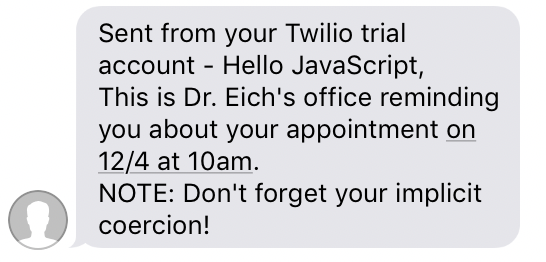

An API for doctor's offices to send SMS appointment reminders to patients, utilizing the Twilio API.

Built during a 4-hour hackathon at Galvanize (Bootcamp) where we had to use a 3rd-party API.

While ideating, a doctor called a couple times just to notify me of an upcoming appointment...we decided to create a simple form that would allow the office to save time spent dialing patients and provide a more convenient reminder medium for patients.

This project has a POST /sms endpoint that accepts a body from a form, which is used to send an SMS to the patient.

### Installation

```shell
$ git clone https://github.com/JBallin/dr-sms-api
$ cd dr-sms-api
$ npm install
$ echo "SID=$YOUR_SID
AUTH_TOKEN=$YOUR_AUTH_TOKEN
TWILIO_NUMBER=$YOUR_TWILIO_NUMBER" > .env
$ npm run dev
```

### Usage

```shell
$ brew install httpie
$ http POST localhost:5492/sms phoneNumber=$YOUR_NUMBER doctorName=Eich patientName=JavaScript date=12/4 time=10am customMsg="Don't forget your implicit coercion!"
```

NOTE: All phone numbers should be in this format: 12813308004

All POST requests return the message response from Twilio.

### SMS Screenshot


